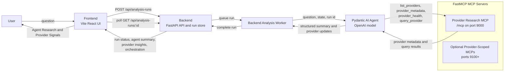
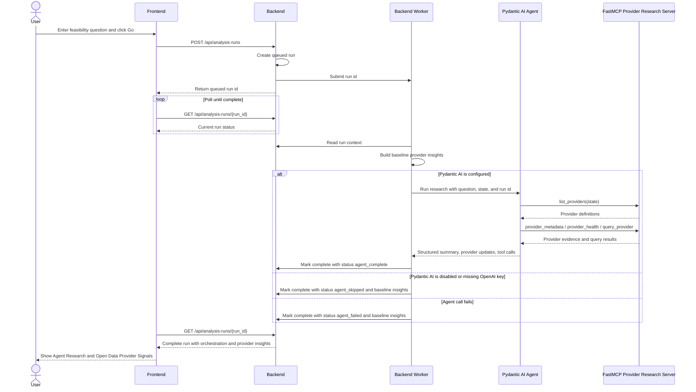

# Design

This document captures the current top-level component design for later updates.

## Top-Level Components



## Component Roles

- `Frontend`: Vite React application. It accepts the user's feasibility question, starts an analysis run, polls for completion, and renders the agent/MCP output in the `Agent Research` and `Open Data Provider Signals` panels.
- `Backend`: FastAPI application API and system of record for analysis runs. It owns the in-memory run store, provider registry, CORS policy, and frontend-facing JSON contracts.
- `Backend Analysis Worker`: background thread that processes queued analysis runs. It first builds baseline provider insights from the backend registry, then delegates enrichment to the Pydantic AI agent when configured.
- `Pydantic AI Agent`: delegated research layer using an OpenAI model configured by `.env`. It connects to the FastMCP endpoint and returns structured output containing an agent summary and provider-specific updates.
- `Provider Research MCP`: default FastMCP server exposed by `make mcp-dev` and `make dev-all`. It intentionally exposes provider research tools only, not the full backend API, so the agent cannot recurse into analysis-run endpoints.
- `Provider-Scoped MCPs`: optional MCP servers for a single provider. They are useful for debugging or independent provider tool testing.

## Request Flow



## Runtime Configuration

The backend loads environment from the repo `.env` and `backend/app/.env`. The repo `.env` is ignored by Git and should contain the local OpenAI key.

```env
PYDANTIC_AI_MODEL=openai:gpt-5.2
PYDANTIC_AI_ENABLED=true
PYDANTIC_AI_MCP_URL=http://127.0.0.1:9000/mcp
OPENAI_API_KEY=
```

If `PYDANTIC_AI_ENABLED=false`, `PYDANTIC_AI_MODEL` is empty, or an OpenAI model is selected without `OPENAI_API_KEY`, the backend uses the provider-registry fallback and returns `agent_skipped`.

## Makefile Targets

The expected local development targets are:

- `make dev-all`: runs FastAPI backend, Vite frontend, and the aggregate FastMCP provider research server.
- `make dev`: runs FastAPI backend and Vite frontend only.
- `make backend-dev`: runs only FastAPI on `127.0.0.1:8000`.
- `make frontend-dev`: runs only Vite on `127.0.0.1:5173`.
- `make mcp-dev`: runs the aggregate provider research MCP on `127.0.0.1:9000/mcp`.
- `make mcp-provider-dev PROVIDER_ID=...`: runs one provider-scoped MCP.
- `make mcp-providers-dev`: runs one provider-scoped MCP per configured provider starting at port `9100`.
- `make test`: runs backend tests and frontend production build.
- `make test-e2e`: runs the Playwright browser flow.
- `make test-all`: runs backend tests, frontend build, and Playwright e2e.
- `make lint`: runs backend Ruff checks.

## UI Signals

After a user clicks `Go`, the results screen shows:

- `Agent Research`: high-visibility summary of the delegated agent/MCP run, including status, provider signal count, and FastMCP endpoint.
- `Open Data Provider Signals`: provider cards returned from the backend. When the agent path completes, the section label reads `Updated by Pydantic AI`; otherwise it reads `Backend provider fallback`.

The expected successful orchestration status is:

```json
{
  "status": "agent_complete",
  "tool_calls": ["fastmcp:http://127.0.0.1:9000/mcp"]
}
```
