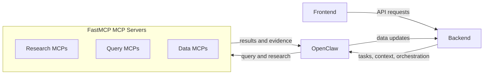

# Design

This document captures the current top-level component design for later updates.

## Component Roles

- `Frontend`: user-facing application that interacts with the backend.
- `Backend`: application API and data owner. It serves the frontend, invokes OpenClaw, and accepts data updates from OpenClaw.
- `OpenClaw`: research and orchestration layer. It can update backend data and use FastMCP-based MCP servers for query and research workflows.
- `FastMCP MCP Servers`: specialized tools exposed through FastMCP for external data lookup, research, and related task-specific capabilities.
